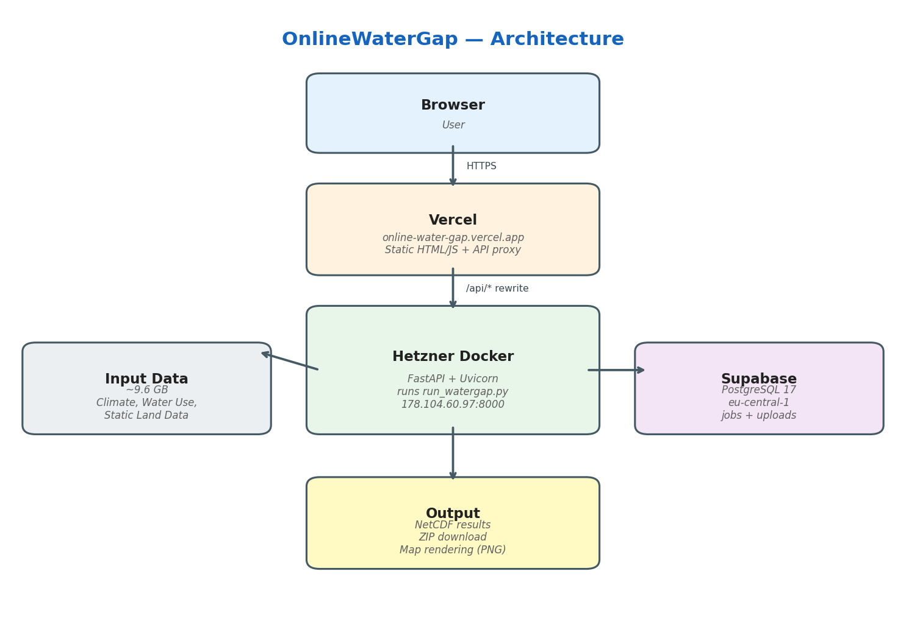

.. _online_infrastructure:

######################
Online Infrastructure
######################

This section documents the architecture and deployment setup of the **OnlineWaterGap** web interface, which makes ReWaterGAP accessible through a browser without modifying the core model code.

.. contents:: On this page
   :local:
   :depth: 2

Overview
========

OnlineWaterGap wraps the existing ReWaterGAP command-line application in a
web-based frontend so that users can configure, launch, and visualise
hydrological simulations from any modern browser.

The stack consists of three components:

1. **Frontend** — static HTML / JavaScript served by Vercel.
2. **Backend** — a FastAPI application running inside a Docker container on
   a Hetzner cloud server.  It spawns ``run_watergap.py`` as a subprocess,
   exactly as a local user would on the command line.
3. **Database** — a Supabase PostgreSQL instance that tracks simulation jobs
   and uploaded datasets.

   High-level data flow of OnlineWaterGap.

Request flow
============

.. code-block:: text

   Browser
     │
     ▼
   Vercel  (online-water-gap.vercel.app)
     │  serves static HTML/JS
     │  proxies /api/* via rewrite rules
     ▼
   Hetzner Docker host  (178.104.60.97:8000)
     │  FastAPI + Uvicorn
     │  starts run_watergap.py as subprocess
     ▼
   WaterGAP simulation
     │  reads input_data/ (9.6 GB, mounted read-only)
     │  writes results to output_data/
     ▼
   Supabase  (eu-central-1)
     │  jobs & uploads tables
     ▼
   Browser receives status updates, logs, result ZIP

Repository layout
=================

All files specific to the online version live in the ``online/`` directory,
keeping the original ReWaterGAP code base untouched:

.. code-block:: text

   online/
   ├── api/
   │   ├── main.py          # FastAPI application
   │   └── static/          # Frontend (HTML, JS, CSS)
   ├── Dockerfile           # Container image definition
   ├── docker-compose.yml   # Service orchestration + volumes
   ├── .dockerignore        # Files excluded from Docker build
   ├── run_web.py           # Dev helper: installs deps + starts uvicorn
   ├── vercel.json          # Vercel routing + API proxy config
   └── .vercelignore        # Files excluded from Vercel deploy

Frontend — Vercel
=================

The frontend is a **static single-page application** (no build step) hosted
on Vercel.

Deployment
----------

* Vercel is connected to the GitHub repository and deploys automatically on
  every push to ``main``.
* The ``gh-pages`` branch is explicitly excluded in ``vercel.json``.
* ``outputDirectory`` is set to ``online/api/static``.

API proxy
---------

To avoid mixed-content issues (the browser page is served over HTTPS while
the Hetzner backend listens on HTTP), Vercel rewrites all ``/api/*``
requests to the backend:

.. code-block:: json

   {
     "rewrites": [
       {
         "source": "/api/:path*",
         "destination": "http://178.104.60.97:8000/api/:path*"
       }
     ]
   }

Backend — Hetzner + Docker
==========================

The compute-heavy simulation runs in a Docker container on a Hetzner cloud
server.

Docker image
------------

The image is based on ``python:3.10-slim`` and installs:

* System libraries for HDF5 / NetCDF4 / Matplotlib
* Python dependencies from ``requirements.txt`` (unchanged from the original)
* ``fastapi``, ``uvicorn``, and ``python-multipart`` as additional web
  dependencies

.. code-block:: dockerfile

   FROM python:3.10-slim
   # ... system deps ...
   COPY requirements.txt .
   RUN pip install --no-cache-dir -r requirements.txt \
       && pip install --no-cache-dir fastapi "uvicorn[standard]" python-multipart
   COPY . .
   EXPOSE 8000
   CMD ["uvicorn", "api.main:app", "--host", "0.0.0.0", "--port", "8000"]

Volumes
-------

``docker-compose.yml`` defines four volumes:

=========================  =============  ==========================================
Volume                     Mode           Purpose
=========================  =============  ==========================================
``./input_data``           read-only      Climate forcing, water use, static data
``watergap-jobs``          read-write     Per-run config, logs, status
``watergap-uploads``       read-write     User-uploaded NetCDF files
``watergap-output``        read-write     Simulation result files
=========================  =============  ==========================================

API endpoints
-------------

.. list-table::
   :header-rows: 1
   :widths: 10 30 60

   * - Method
     - Path
     - Description
   * - GET
     - ``/api/health``
     - Health check
   * - POST
     - ``/api/simulate``
     - Start a new WaterGAP simulation
   * - GET
     - ``/api/status/{job_id}``
     - Poll job status (running / completed / failed)
   * - POST
     - ``/api/cancel/{job_id}``
     - Terminate a running simulation
   * - GET
     - ``/api/result/{job_id}``
     - Download results as ZIP
   * - GET
     - ``/api/log/{job_id}``
     - Stream simulation log
   * - GET
     - ``/api/input-datasets``
     - List available input data bundles
   * - POST
     - ``/api/upload``
     - Upload a custom NetCDF file
   * - GET
     - ``/api/map/{source_id}``
     - Render a spatial map (PNG)

Database — Supabase
===================

A Supabase project (``rewatergap``, region ``eu-central-1``) provides a
managed PostgreSQL 17 database with two tables:

**jobs**

Tracks every simulation run.  Key columns: ``job_id``, ``status``,
``config`` (JSONB), ``period_start``, ``period_end``, ``log_tail``,
``created_at``, ``completed_at``.  Row-Level Security is enabled.

**uploads**

Stores metadata for user-uploaded NetCDF files.  Key columns:
``upload_id``, ``filename``, ``variables`` (text array),
``file_size_bytes``, ``created_at``.  Row-Level Security is enabled.

Changes relative to the original code base
===========================================

The online version deliberately keeps changes **minimal**.  The core model
code (``model/``, ``controller/``, ``calibration/``, ``view/``) and the
``requirements.txt`` are **identical** to the upstream ReWaterGAP repository.

The only additions are:

.. list-table::
   :header-rows: 1
   :widths: 35 65

   * - File
     - Purpose
   * - ``online/api/main.py``
     - FastAPI wrapper that calls ``run_watergap.py`` as a subprocess
   * - ``online/api/static/``
     - Browser-based frontend (single-page app)
   * - ``online/Dockerfile``
     - Replaces the original conda-based Dockerfile with a slim pip-based
       image that starts Uvicorn instead of a one-shot CLI run
   * - ``online/docker-compose.yml``
     - Adds volume mounts for input data, jobs, uploads, and output
   * - ``online/run_web.py``
     - Developer convenience script (auto-installs FastAPI, starts server)
   * - ``online/vercel.json``
     - Routes frontend traffic and proxies API calls to Hetzner
   * - ``online/.vercelignore``
     - Excludes Python / Docker files from Vercel build
   * - ``online/.dockerignore``
     - Excludes IDE / cache files from Docker build
   * - ``docs/online_infrastructure/``
     - This documentation page
